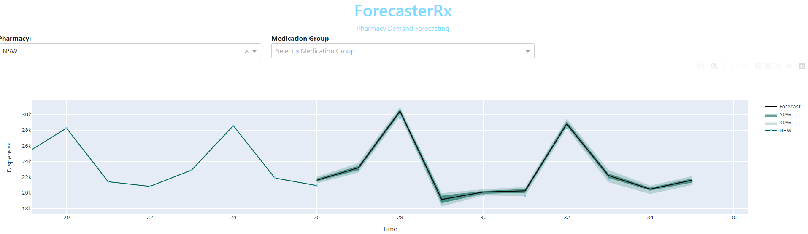

About forecasterRx
=================
Predictive analytics platform for retail pharmacy operations.

Main Features
=================

* Demand Forecasting

    - Uses neural network hierarchical reconcilliation to produce coherent forecasts for all levels of medication inventory.
    - Calculates inventory units needed for desired days on hand.

Getting Started
=================

1. Clone repository.
1. Ensure docker and [docker compose](https://docs.docker.com/compose/install/) are installed.
1. `docker compose up`
1. Navigate to http://localhost:8050/ to view application.
